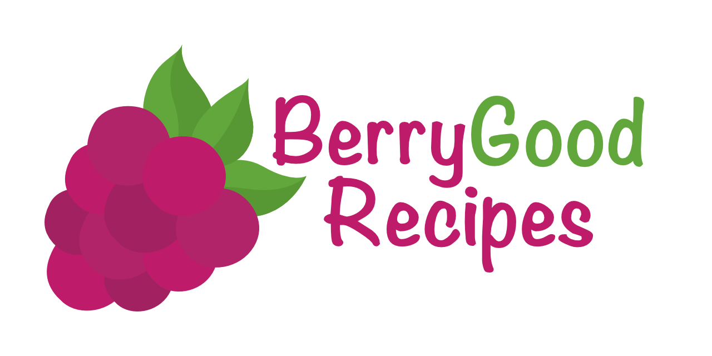

# BerryGoodRecipes

A cook book app created for a university project made to be fully functional and usable.
It is made using Java 11, JavaFX and PostgreSQL (with PGJDBC).

#### Features:
* Search for recipes using name and/or search by user, group, ingredient, maximum cost, maximum preparation time, minimal rating and many more...
* Convert the units present in recipe in-app on a separate window or on the recipe page itself
* Set a unit system as your preferred, so that all recipes will be shown to you automatically converted to it
* Scale your meals to any portion you want on the recipe window without a hassle
* Easily save all the ingredients you will need in your shopping list
* Add, edit and delete a recipe using the intuitive in-app editor
* Set a recipe as your favorite to have easy access to it later
* Create groups, invite other users to them and share your recipes and shopping lists to them
* Comment and rate other recipes, saying thank you to the author or helping him improve the recipe
* Set a timer during cooking to not accidentally forget and burn your delicious meal
* Follow other users to give yourself an easy way to find all the delicious recipes created by a user with a name too complicated to remember
* Choose from a plethora of themes to personalize your cook book just the way you want

Sadly, in the current form it will not launch after a clone, because of missing config file in the repository. For the time being it will not be here because of security reasons.

Original, unmodified logo image is available at www.freevector.com.

The 'Mali' font family has been downloaded from [fonts.google.com](fonts.google.com).
